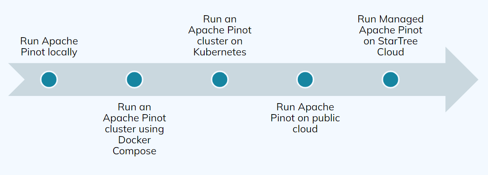
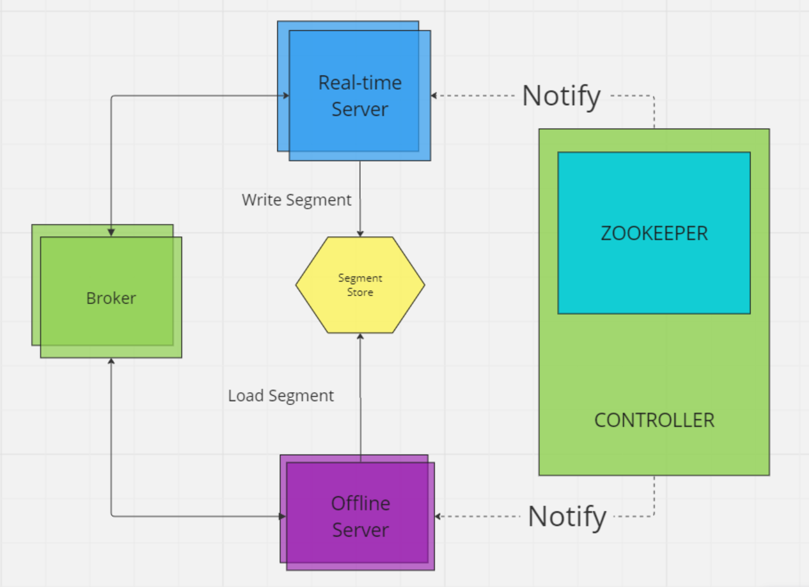
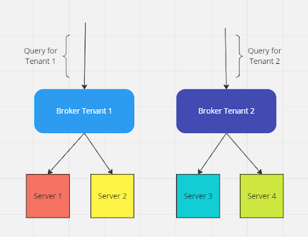
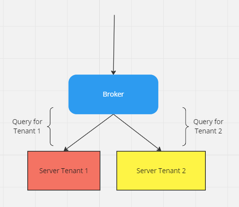
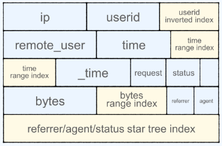
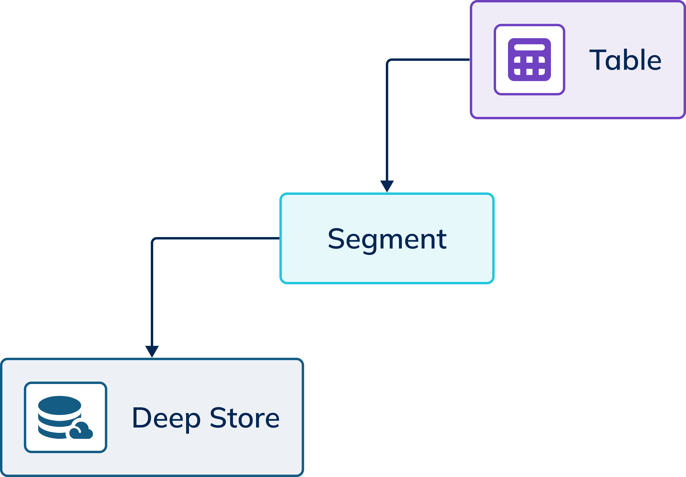
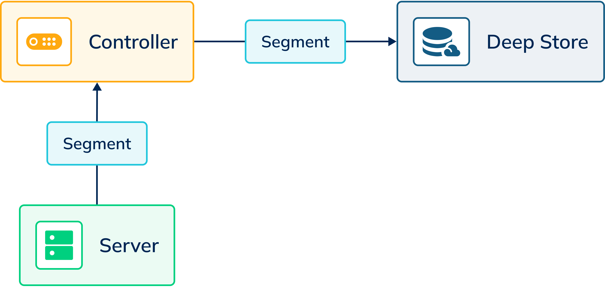
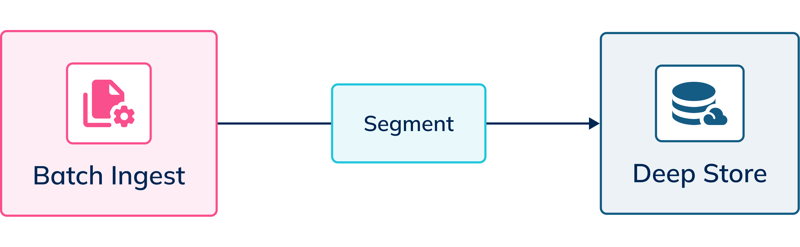
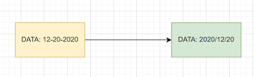

:doctype: book
:icons: font

= Apache Pinot Advanced

This is an advanced course for Apache Pinot. This course is designed to help you understand the advanced concepts of Apache Pinot. This course is designed for developers, data engineers, and data scientists who want to learn how to use Apache Pinot to build real-time analytics applications.

== Overview

== Prerequisite for this course
We recommend that before you start this course, you have:

* Completed the Pinot 101 course, available here https://www.youtube.com/watch?v=LMb-OK_RExE&list=PLihIrF0tCXdfN6y-twj9KtWaXM1GH4RSe
* Ran the Apache Pinot Quick Start, available here https://dev.startree.ai/

== What is Covered
In this course, we will go over:

* How to create a Pinot Cluster
* How to configure Tenants
* How to create Schemas, Tables, and Segments
* How to ingest Data
* How to use and configure Upserts
* How to transform data during Ingestion
* How to query your data and supported SQL syntax
* How to leverage Indexes
* How to leverage Minions
* How to decide when to use Pinot
* Some use cases that work for Pinot

== Format and Tools

This course uses Docker Compose for all the exercises. While you do not need to be an expert, some familiarity with Docker Compose is strongly suggested.

== Cluster Creation

== Deploying a Pinot Cluster

Apache Pinot can be deployed in the following ways:

* Run locally
* Run using Docker Compose
* Run using Kubernetes
* Run on your own public cloud
* Run on StarTree Cloud

== Apache Pinot Components
The following diagram describes the componentsof Apach Pinot:

* Controller
** Zookeeper
* Broker
* Server
** Real-tim
** Offlien
* Minion (optional)

=== Docker Compose Deployment

We will deploy the following four service and a network:

====
[source]
----
version: '3.7'
services:
zookeeper:          <1>
    …
pinot-controller:   <2>
    …
pinot-broker:       <3>
    …
pinot-server:       <4>
    …
networks:           <5>
  pinot-advanced:
    name: pinot-advanced

----

<1> Zookeeper - this keeps configuration and metadata
<2> Pinot Controller - this is the admin interface
<3> Pinot Broker - this is the query interface
<4> Pinot Server - this is the data interface
<5> Network - this is the network that all the services will use

====

== Zookeeper Configuration

Zookeeper’s configuration defines the following:
====
[source]
----
zookeeper:
    image: zookeeper:3.5.6          <1>
 container_name: zookeeper          <2>
    hostname: zookeeper             <3>
        ports:                      <4>
      - "2181:2181"
    environment:
      ZOOKEEPER_CLIENT_PORT: 2181   <5>
      ZOOKEEPER_TICK_TIME: 2000     <6>
    networks:                       <7>
      - pinot-advanced
----

<1> Image version
<2> Container name
<3> Host name
<4> Ports to be exported, internal & external mapping
<5> Client Port – where Zookeeper can be accessed
<6> Tick time (in milliseconds) to measure cluster heartbeat.
<7> Network to use
====

== Controller Configuration

Pinot Controller’s configuration defines the following:
====
[source]
----
pinot-controller:
    image: apachepinot/pinot:1.0.0      <1>
    command: "StartController -zkAddress zookeeper:2181"   <2>
    container_name: "pinot-controller"      <3>
    restart: unless-stopped         <4> 
    ports:                        <5>   
      - "9000:9000"
    depends_on:              <6>    
      - zookeeper
    networks:               <7> 
      - pinot-advanced

----
<1> Image version
<2> Start Command
<3> Container name
<4> Restart Policy
<5> Ports to be exported, internal and external mapping
<6> Dependency
<7> Network to use
====

== Server Configuration
Pinot Server’s configuration defines:

====
[source]
----
pinot-server:
    image: apachepinot/pinot:1.0.0          <1>
    command: "StartServer -zkAddress zookeeper:2181"    <2>
    restart: unless-stopped     <3>
    container_name: "pinot-server"          <4>
    depends_on:                                 <5>
      - pinot-broker
    networks:                                       <6>
      - pinot-advanced
----
<1> Image version
<2> Start Command
<3> Restart Policy
<4> Container name
<5> Dependency
<6> Network to use
====

== Cluster Configuration

Cluster configuration is stored in the Zookeeper. 
Cluster configuration defines the following:
====
[source]
----
"allowParticipantAutoJoin": "true"                  <1>
"enable.case.insensitive": "false"                  <2>
"pinot.broker.enable.query.limit.override": "true"  <3>
"default.hyperloglog.log2m": "true"                 <4>
"queryConsoleOnlyView": "false"                     <5>
"hideQueryConsoleTab": "false"                      <6>
----
<1> Whether Server, Broker, and Controller can auto-join
<2> Case sensitivity rules
<3> Broker query limits 
<4> Hyperloglog for distinct approximations
<5> Zookeeper visibility in Pinot UI
<6> Query Console tab visibility in Pinot UI.
====

== Exercise 1: Deploying a Pinot Cluster
[cols="1,1"]
|===
a|image::images/plus.png[]
|In this exercise, we will create an Apache Pinot Cluster using Docker Compose.
a|image::images/link.png[]
|https://github.com/startreedata/learn/pinot-advanced/create-cluster
a|image::images/check.png[]
a|* [ ] Successfully deploy a cluster
* [ ] Check cluster health by navigating to http://localhost:9000
* [ ] Verify that 1 controller, 1 broker, and 1 server are deployed, and that their status is alive.
|===

== Tenants

== Tenants in Pinot

image::images/tenant.jpg[]

A tenant is a logical component defined as a group of server/broker nodes with the same tag.

Tenants can be defined for broker and/or server.

== Broker Tenant in Pinot

Broker Tenants allow for separation of data and query requests at the broker level.

A sample use case might be a cluster that hosts data for multiple clients, and might need to segregate traffic as well as data.

== Server Tenant in Pinot

Server tenants allow for separation of data at a Server level.

Typical use case might be segregating data by department within a company.

== Creating a Server Tenant: CLI

Tenants can be created using the CLI.  
A pre-requisite is that an untagged server must be available.

[source, bash]
====
bin/pinot-admin.sh AddTenant \
    -name ServerTenant \
    -role SERVER \
    -instanceCount 1,
    -offlineInstanceCount 1 \
    -realtimeInstanceCount 1 -exec
====

== Creating a Broker Tenant: CLI

Tenants can be created using the CLI. A pre-requisite is that an untagged broker must be available.

[source, bash]
----
bin/pinot-admin.sh AddTenant \
    -name BrokerTenant \
    -role BROKER \
    -instanceCount 1 \
-offlineInstanceCount 0 \
    -realtimeInstanceCount0 –exec
----

== Creating a Server Tenat: API

To create a Server Tenant: 

[source, bash]
----
curl -i -X POST -H 'Content-Type: application/json' -d @sample-server-tenant.json localhost:9000/tenants
----

The content of the sample-server-tenant.json:

[source]
----
{
     "tenantRole" : "SERVER",
     "tenantName" : "ServerTenant",
     "offlineInstances" : 1,
     "realtimeInstances" : 1
}

----

== Creating a Broker Tenat: API

To create a Broker Tenant: 

[source, bash]
----
curl -i -X POST -H 'Content-Type: application/json' -d @sample-broker-tenant.json localhost:9000/tenants
----

The content of the sample-broker-tenant.json:

[source]
----
{
     "tenantRole" : "BROKER",
     "tenantName" : "BrokerTenant",
     "numberOfInstances" : 1
}
----

== Exercise: Create Tenant
[cols="1,1"]
|===
a|image::images/plus.png[]
|In this exercise, we will create a tenant using CLI & API.
a|image::images/link.png[]
|https://github.com/startreedata/learn/pinot-advanced/add-tenat
a|image::images/check.png[]
a|* [ ] Successfully deploy a tenant
* [ ] Check cluster health by navigating to http://localhost:9000
* [ ] Verify that 2 tenants are available in the UI.
|===

== Schemas, Tables, and Segments

== Offline vs. Hybrid vs. Real-time Tables

Pinot supports three types of tables:

[cols="1,1,1"]
|===
a|Offline
Offline tables ingest static data from external data stores and are generally used for batch ingestion.
a|Hybrid
Hybrid Pinot tables have both real-time as well as offline tables under the hood. By default, all tables in Pinot are hybrid.
a|Real-time
Real-time tables ingest data from streams (such as Kafka) and build segments from the consumed data.
|===

== Segments

* In Pinot, tables are conceptual. Data is actually stored * in segments.
* A segment is a horizontal shard representing a chunk of table data.
* Queries can also be run against specific segments.
* Segments can be reloaded.

[source]
----
{
   "ip": "111.173.165.103",
   "userid": 10,
   "remote_user": "-",
   "time": "3271",
   "_time": 3271,
   "request": "GET",
   "status": "406",
   "bytes": "1289",
   “referrer": "-",
   "agent": "Mozilla/5.0"
}
----

== Deep Store

* Segments are stored in Deep store.
* Deep store is used for backup and restore operations.
* When new servers are spun up, they access segments from the deep store.

== Data Flow in Real-time Segments

* In the case of Real Time tables, data is written to a segment.
* The server responsible for the segments communicates the segment changes to the Controller.
* The controller writes the Segment to the Deep Store.

== Data Flow in Offline Segments

* In the case of Real Time tables, data is written to a segment.
* The server responsible for the segments communicates the segment changes to the Controller.
* The controller writes the Segment to the Deep Store.

== Create Schema and table

Pinot supports three ways to create schemas and tables of table:
1. CLI
2. API
3. UI

=== Schema Configuration

A schema configuration file is JSON.  It defines the following:

====
[source]
----
{
  "schemaName": "flights",      <1>
  "dimensionFieldSpecs": […],   <2>
  "metricFieldSpecs": […],      <3>
  "dateTimeFieldSpecs": […]     <4>
}
----
<1> Schema name
<2> Dimension fields
<3> Metric fields
<4> Date Time fields
====

== Defining Schema Fields

Data types can be INT, LONG, FLOAT, DOUBLE, BOOLEAN, TIMESTAMP, STRING, BYTES, JSON
====
[source]
----
{
 "name": "tags",
 "dataType": "STRING",          <1>
 "singleValueField": false,
 "defaultNullValue": "null"
},...
{      
 "name": "flightNumber",      
 "dataType": "LONG"             <2>
},..
{
 "name": "flightTime", 
 "dataType": "milliseconds"     <3>
}
----
<1> Dimension fields can be any data type and are used to filter or group by
<2> Metric fields are numeric and are used for aggregation
<3> DateTime fields typically include one primary field for time series data
====

== Table Configuration

A table configuration file is JSON. It defines the following:

====
[source]
----
{
    "tableName": "order",
    "tableType": "REALTIME",
    "segmentsConfig": {},     <1>
    "tenants": {},            <2>
    "tableIndexConfig": {},   <3>
    "ingestionConfig": {},    <4>
    "upsertConfig": {},       <5>
    "dedupeConfig": {},       <6>
    "metadata": {},           <7>
    "routing": {}             <8>
}
----
<1> Allows setting quotas for storage and queries
<2> Setting Tenants
<3> Index definitions
<4> Ingestion configuration
<5> Ingestion configuration
<6> Dedupe configuration
<7> Metadata allows adding any additional configuration
<8> Routing allows defining how brokers select servers to route

====

== Sergment Configuration

A segment configuration section in the table config file defines the following:

====
[source]
----
"segmentsConfig": {
   "timeColumnName": "ts",        <1>
   "timeType": "MILLISECONDS",    <2>
   "retentionTimeUnit": "DAYS",   <3>
   "retentionTimeValue": "1",     <4>
   "replication": "1"             <5>  
}
----
<1> Time column name.  This must match the name defined in the Schema.
<2> Time type
<3> Retention time unit
<4> Retention time value
<5> Replication factor
====

== CLI Deployment

* Use the pinot-admin.sh script to create schema and table
* AddTable option allows for either the schemaFile and the tableConfigFile as options to create the schema and table individually or together
* Use the exec option to execute.  Leave out the exec option to validate syntax.

[source]
----
/opt/pinot/bin/pinot-admin.sh AddTable -schemaFile /opt/pinot/examples/batch/githubEvents/githubEvents_schema.json -tableConfigFile /opt/pinot/examples/batch/githubEvents/githubEvents_offline_table_config.json -exec 
----

== Dimension Tables

Dimension tables are  used for lookups.  The cannot be HYBRID or REALTIME.  They are replicated on all hosts, for faster lookups.  They are typically small.

== Dimension Table Configuration

To configure a table as dimension table:

====
[source]
----
{
  "OFFLINE": { … 
  "segmentsConfig": {      …
     "segmentPushType": "REFRESH"  }, <1>
},
  "metadata": {},
  "quota": {  "storage": "200M"  },
  "isDimTable": true           <2>
    }
  "dimensionTableConfig": {
  "disablePreload": true      <3>
    }
  }
}
...
{
  "dimensionFieldSpecs": [      <4>
  {
    "dataType": "STRING",
    "name": "teamID"
  },
  …],
}
----
<1> Set segmentPushType to REFRESH
<2> Set isDimTable to true
<3> Set disablePreload to true
<4> Define the dimensionFieldSpec section
====

== Exercise: Add Schema & Table
[cols="1,1"]
|===
a|image::images/plus.png[]
|In this exercise, we will create a schema and tables using CLI, API & UI.
a|image::images/link.png[]
|https://github.com/startreedata/learn/pinot-advanced/add-table
a|image::images/check.png[]
a|* [ ] Successfully create a schema, a realtime table and an offline table
* [ ] Check cluster health by navigating to http://localhost:9000
* [ ] Verify that tables created are available.
|===

== Data Ingestion

== Batch vs. Streaming vs. Hybrid Ingestion

Pinot supports the following types of ingestion

* Batch ingestion
* Streaming ingestion
* Hybrid ingestion

== Batch Ingestion

* Batch ingestion is typically for offline tables. 
* Data can be ingested from disk, spark or Hadoop.
* Batch ingestion can be done using CLI, API or the UI.  
* Minion Tasks can also be configured for batch ingestion.

== Streaming Ingestion

* Streaming ingestion supports ingestion from streaming sources such as Kafka, Kinesis, and Pulsar.
* Additional connectors are available for streaming ingestion.

== Hybrid Ingestion

* Hybrid scenarios support both offline and streaming ingestion.
* Each ingestion needs to be defined separately.

== Batch ingestion using JobSpec

* Use a YAML file to define the ingestion process (as shown) when ingesting using CLI
* Defines FrameworkSpec, JobType, input path and patterns, output directory as well as pinot related information, including cluster, table, etc.
* Allows defining retries and timeouts
* This is the recommended method.

[source, bash]
----
bin/pinot-admin.sh LaunchDataIngestionJob -jobSpecFile /tmp/pinot-quick-start/batch-job-spec.yaml
----

== The JobSpec File
The JobSpec file is a YAML file.  It defines the ingestion process.
Hre are the sections defined in the JobSpec yaml file:

====
[source, yaml]
----
executionFrameworkSpec: …     // <1>
jobType: …                    // <2>
inputDirURI: …                // <3>
includeFileNamePattern: …     // <4>
searchRecursively: true       // <5>
outputDirURI: …               // <6>
overwriteOutput: true         // <6> 
pinotFSSpecs: …               // <7>
recordReaderSpec: …           // <8>
tableSpec: …                  // <9>
segmentNameGeneratorSpec: …   // <10>
pinotClusterSpecs: …          // <11>
pushJobSpec: …                // <12>
----
<1> Execution Framework specifies the how segments will be created
<2> Job Type specifies the type of job 
====

== Execution Frameworks
This section defines ingestion jobs to be running, and the framework used.
====
[source, yaml]
----
executionFrameworkSpec:
 name: 'standalone'
 segmentGenerationJobRunnerClassName: 'org.apache.pinot.plugin.ingestion.batch.standalone.  SegmentGenerationJobRunner' #<1>
 segmentTarPushJobRunnerClassName: 'org.apache.pinot.plugin.ingestion.batch.standalone.SegmentTarPushJobRunner' #<2>
 segmentUriPushJobRunnerClassName: 'org.apache.pinot.plugin.ingestion.batch.standalone.SegmentUriPushJobRunner' #<3>
 segmentMetadataPushJobRunnerClassName: 'org.apache.pinot.plugin.ingestion.batch.standalone.SegmentMetadataPushJobRunner' #<4>
----
<1> Segment created using files
<2> Segment created using Tar files
<3> Segment created using files using URI
<4> Segment created using metadata
====

== Data Type
Record Reader Spec defines the data type to be ingested.
====
[source, yaml]
----
# recordReaderSpec: defines all record reader
recordReaderSpec:
# dataFormat: Record data format, e.g. 'avro', 'parquet', 'orc',etc.
dataFormat: 'csv'     # <1>
# className: Corresponding RecordReader class name.
className: 'org.apache.pinot.plugin.inputformat.csv.CSVRecordReader'      # <2>
# configClassName: Corresponding RecordReaderConfig class name
# E.g.org.apache.pinot.plugin.inputformat.csv.CSVRecordReaderConfig
configClassName: 'org.apache.pinot.plugin.inputformat.csv.CSVRecordReaderConfig'      # <3>
# configs: Used to init RecordReaderConfig class name 
configs:    # <4>
----
<1> Data format, e.g. csv, avro, parquet, orc, etc.
<2> Class name that will be used to process the records
<3> Config class name that will be used to process the file
<4> Additional Configs
====

== Job Type

Pinot supports several ways to write to the segment in the offlien mode.  The job type defines the method to be used.

====
[source, yaml]
----

# jobType: Pinot ingestion job type.
# Supported job types are defined in PinotIngestionJobType class.
#   'SegmentCreation'           <1>
#   'SegmentTarPush'            <2>
#   'SegmentUriPush'            <3>
#   'SegmentMetadataPush'       <4>
#   'SegmentCreationAndTarPush' <5>
#   'SegmentCreationAndUriPush' <6>

jobType: SegmentCreationAndTarPush
----
<1>  Basic segment creation
<2> Segment creation using Tar files
<3> Segment creation using URI
<4> Segment creation using metadata
<5> Segment creation and Tar push
<6> Segment creation and URI push
====

== Segment Tar Push

Upload the entire segment to the Pinot controller as a tar file.  The controller in turn will save the segment, extract metadata and add the segment to the table.

== Segment URI Push

POST the segment (also tar) to the Pinot controller.  The controller downloads the segment, extracts the metadata and adds segment to the table. 

Requires the segment tar file stored on a deep store with a globally accessible segment tar URI

== Segment Metadata Push

Download segment based on the URI, extract the metadata and upload to the Pinot Controller. The controller will add the segment to the table.

Requires the segment tar file stored on a deep store with a globally accessible segment tar URI.

== JobSpec Input Output

The JobSpec file defines the input and output directories.

====
[source, yaml]
----
# inputDirURI: Root directory of input data, expected to have scheme configured in PinotFS.
inputDirURI: 'examples/batch/baseballStats/rawdata' #<1>
# includeFileNamePattern: include file name pattern, supported glob pattern.
includeFileNamePattern: 'glob:**/*.csv' #<2>
# excludeFileNamePattern: exclude file name pattern, supported glob pattern.
# _excludeFileNamePattern: ''
# outputDirURI: Root directory of output segments, expected to have scheme configured in PinotFS.
outputDirURI: 'examples/batch/baseballStats/segments' #<3>
# overwriteOutput: Overwrite output segments if existed.
overwriteOutput: true #<4>
----
<1> Input directory
<2> File name pattern
<3> Output directory
<4> Overwrite output segments if existed flag
====

== JobSpec - Defining FileSystem

The JobSpec file defines the file system to be used.

====
[source, yaml]
----
# pinotFSSpecs: defines all related Pinot file systems.
pinotFSSpecs:
# scheme: used to identify a PinotFS.
# E.g. local, hdfs, dbfs, etc
scheme: file  #<1>
# className: Class name used to create the PinotFS instance.
# E.g.
# org.apache.pinot.spi.filesystem.LocalPinotFS is used for local filesystem
# org.apache.pinot.plugin.filesystem.AzurePinotFS is used for Azure Data Lake
#org.apache.pinot.plugin.filesystem.HadoopPinotFS is used for HDFS
className: org.apache.pinot.spi.filesystem.LocalPinotFS #<2>
----
<1> Scheme used to identify the PinotFS
<2> Class name used to create the PinotFS instance
====

== JobSpec - Defining Table

The JobSpec file defines the table to be used.

====
[source, yaml]
----
# tableSpec: defines table name and where to fetch corresponding table config and table schema.
tableSpec:
# tableName: Table name
tableName: 'baseballStats'  #<1>
# schemaURI: defines where to read the table schema, PinotFS or HTTP.
schemaURI: 'http://localhost:9000/tables/baseballStats/schema'  #<2>
# tableConfigURI: defines where to reade the table config.
# Supports using PinotFS or HTTP.
tableConfigURI: 'http://localhost:9000/tables/baseballStats'  #<3>
----
<1> Table name
<2> Schema URI
<3> Table Config URI
====

== JobSpec - Defining Cluster Specification

The JobSpec file defines the cluster to be used.
====
[source, yaml]
----
# pinotClusterSpecs: defines the Pinot Cluster Access Point.
pinotClusterSpecs:
   # controllerURI: used to fetch table/schema information and data push.
   # E.g. http://localhost:9000
   controllerURI: 'http://localhost:9000'  #<1>
----
<1> Controller URI used for the data push
====

== JobSpec - Defining Push Job Specification

The JobSpec file defines the push job to be used.
====
[source, yaml]
----
# pushJobSpec: defines segment push job related configuration.
pushJobSpec:
# pushAttempts: number of attempts for push job, default is 1, which means no retry.
pushAttempts: 2 #<1>  
# pushRetryIntervalMillis: retry wait Ms, default to 1 second.  pushRetryIntervalMillis: 1000
----
<1> Number of attempts for push job
====

== Batch Ingestion using UI

* Data can be ingested using the UI
* This example shows ingestion from an S3 bucket
* The URL can be S3 or any accessible URL

[source, sql]
----
SET taskName = 'myTask-s3';
SET input.fs.className = 'org.apache.pinot.plugin.filesystem.S3PinotFS';
SET input.fs.prop.accessKey = '<my-key>';   --<1>
SET input.fs.prop.secretKey = '<my-secret>';  --<2>
SET input.fs.prop.region = 'us-west-2'; --<3>
INSERT INTO "baseballStats"               --<4>
FROM FILE 's3://my-bucket/public_data_set/baseballStats/rawdata/' --<5>
----
<1> Your Access Key for the s3 account
<2> Your Secret Key for the s3 account
<3> The region where the s3 bucket is located
<4> The table to insert into
<5> The s3 URL of the data to be ingested

== Batch Ingestion using API

* Data can be ingested using the API
* This is not recommended for production use, since the file is downloaded locally and posted.

[source, bash]
----
curl -X POST -F file=@data.csv -H "Content-Type: multipart/form-data" \
"http://localhost:9000/ingestFromFile?tableNameWithType=foo_OFFLINE&
batchConfigMapStr={
  'inputFormat':'csv',
  'recordReader.prop.delimiter':'|'}"
----

== Backfill Data

* Pinot allows backfilling data.
* Backfill replaces existing data with different data, with the same keys per segment.

image:  images/backfill.png[]

==  Exercise: Ingest Data

[cols="1,1"]
|===
a|image::images/plus.png[]
|n this exercise, we will ingest data using CLI, API & UI.
a|image::images/link.png[]
|https://github.com/startreedata/learn/pinot-advanced/batch-ingestion
a|image::images/check.png[]
a|* [ ] Successfully ingest rows into a table
* [ ] Check tables by navigating to localhost:9000/#/query
* [ ] Query table using Query Interface.
|===

== Data Ingestion: Streaming

* Supports ingestion from streaming platforms such as Kafka, Kinesis, and Pulsar
* Allows for queries within seconds of publication
* Is integrated with table configuration, no additional step for ingestion
* Easy to configure
* Can be paused, throttled, and resumed.

== Streaming Ingestion using Kafka

Ingestion from Kafka is supported in the Table config for Real-time tables.

====
[source]
----
"ingestionConfig": {    
"streamIngestionConfig": {       
 "streamConfigMaps": [{           
    "realtime.segment.flush.threshold.rows": "0",
    "stream.kafka.decoder.prop.format": "JSON",            
    …
    "streamType": "kafka",      <1>
    "value.serializer": … ,
    "stream.kafka.consumer.type": "LOWLEVEL",
    "realtime.segment.flush.threshold.segment.rows": "50000",   <2>
    "stream.kafka.broker.list": "localhost:9876",               <3>
    "realtime.segment.flush.threshold.time": "3600000",
    "stream.kafka.consumer.factory.class.name": … ,
    "stream.kafka.consumer.prop.auto.offset.reset": "smallest", 
    "stream.kafka.topic.name": "transcript-topic",              <4>
    "topic.consumption.rate.limit": 1000                        <5>
  }] 
}
----
<1> Stream type Kafka
<2> Segment flush threshold
<3> Kafka broker list
<4> Kafka topic name
<5> Topic consumption rate limit
====

== Streaming Ingestion using Kinesis

Kinesis ingestion can be specified in the Table config file for Real-time tables.

====
[source]
----
"streamConfigs":
{
  "streamType": "kinesis",          <1>
  "stream.kinesis.topic.name": "<stream name>", <2>
    "region": "<your region>",
    "accessKey": "<your access key>",
    "secretKey": "<your secret key>",
    "shardIteratorType": "AFTER_SEQUENCE_NUMBER", <3>
    "stream.kinesis.consumer.type": "lowlevel",
    "stream.kinesis.fetch.timeout.millis": "30000",
    "stream.kinesis.decoder.class.name": "org.apache.pinot.plugin.stream.kafka.KafkaJSONMessageDecoder",
    "stream.kinesis.consumer.factory.class.name": "org.apache.pinot.plugin.stream.kinesis.KinesisConsumerFactory",
    "realtime.segment.flush.threshold.rows": "1000000",
    "realtime.segment.flush.threshold.time": "6h" 
}
----
<1>  Stream type Kinesis
<2>  Kinesis topic name, region, access key, and secret key
<3>  Shard iterator type - which message to consume
====

== Stream Ingestion using Pulsar

Pulsar ingestion can be specified in the Table config file  for Real-time tables.

====
[source]
----
"streamConfigs": {
      "streamType": "pulsar",     <1>
      "stream.pulsar.topic.name": "<your pulsar topic name>",   <2>
      "stream.pulsar.bootstrap.servers": "pulsar://localhost:6650,pulsar://localhost:6651", <3>
      "stream.pulsar.consumer.prop.auto.offset.reset" : "smallest",
      "stream.pulsar.consumer.type": "lowlevel",
      "stream.pulsar.fetch.timeout.millis": "30000",
      "stream.pulsar.decoder.class.name":… ,
      "stream.pulsar.consumer.factory.class.name": … , 
      "realtime.segment.flush.threshold.rows": "1000000",
      "realtime.segment.flush.threshold.time": "6h"
    }
----
<1> Stream type Pulsar
<2> Pulsar topic name
<3> Pulsar bootstrap servers
====

== Additional Streaming Configurations

Some additional configurations for streaming ingestion include:

====
[source]
----
"ingestionConfig": {
    "streamIngestionConfig": {
       …
     },
    "continueOnError": true,        <1>
    "rowTimeValueCheck": true,      <2>
    "segmentTimeValueCheck": false  <3>
}
----
<1> Continue on error
<2> Row time value check
<3> Segment time value check
====

== Pause and REsume Streaming Ingestion

* Stream consumption can be paused and resumed
* This can be done using the API of CLI
* When resuming, you can specify an additional parameter "resumeFrom=smallest/larget"
====
[source, bash]
----
curl -X POST {controllerHost}/tables/{tableName}/pauseConsumption   <1>
curl -X POST {controllerHost}/tables/{tableName}/resumeConsumption  <2>
----
<1> Pause consumption
<2> Resume consumption
====

== Exercise: Ingest Streaming Data
[cols="1,1"]
|===
a|image::images/plus.png[]
|In this exercise, we will create a table for stream ingestion, and ingest data using CLI.
a|image::images/link.png[]
|https://github.com/startreedata/learn/pinot-advanced/stream-ingestion
a|image::images/check.png[]
a|* [ ] Successfully create table and ingest data into a real-time table
* [ ] Check tables by navigating to localhost:9000/#/query
* [ ] Query table using Query Interface.
|===

== Queries

== Querying Pinot

* Pinot supports SQL interface based on Calcite SQL
* Supports standard SQL syntax
* Supports UI, CLI and API
* As of Pinot 1.0, the multi-stage query engine supports inner join, left-outer, semi-join, and nested queries out of the box.

[source, sql]
----
SELECT COUNT(*), MAX(foo), SUM(bar) 
FROM myTable

SELECT MIN(foo), MAX(foo), SUM(foo), AVG(foo), bar, baz 
FROM myTable
GROUP BY bar, baz 
LIMIT 50

SELECT MIN(foo), MAX(foo), SUM(foo), AVG(foo), bar, baz 
FROM myTable
GROUP BY bar, baz 
ORDER BY bar, MAX(foo) DESC 
LIMIT 50
----

== Aggregation Functions

* A large number of aggregation functions are supported by Pinot
* In the exercise related to this section, we will cover several of the aggregation functions
* For a complete list, go here:
** https://docs.pinot.apache.org/users/user-guide-query/query-syntax/supported-aggregations

[source, sql]
----
SELECT SUM(COL1) FILTER (WHERE COL2 > 300), AVG(COL2) FILTER (WHERE COL2 < 50) 
FROM MyTable WHERE COL3 > 50
----

== Cardinality Estimation

* Cardinality estimation is the problem of finding the number of distinct elements in a data stream with repeated elements
* Functions Supported for CE:
** DistinctCountHLL
** DistinctCountThetaSketch
** DistinctCountRawThetaSketch
** avgValueIntegerSumTupleSketch
** distinctCountTupleSketch
** distinctCountRawIntegerSumTupleSketch
* Functions Supported for CE:
** sumValueIntegerSumTupleSketch
** distinctCountCpcSketch
** distinctCountRawCpcSketch
** distinctCountULL
** distinctCountRawULL

[source, sql]
----
select distinctCountThetaSketch(
  sketchCol, 
  'nominalEntries=1024', 
  'country'=''USA'' AND 'state'=''CA'', 'device'=''mobile'', 'SET_INTERSECT($1, $2)'
) 
from table 
where country = 'USA' or device = 'mobile...'

select distinctCountCpcSketch(DivAirports) AS value
from airlineStats
----

== Query Plan

Apache Pinot supports query plans.  A query plan is a sequence of steps used to access data in a database management system.

[source, sql]
----
EXPLAIN PLAN FOR 
Select
   P_BRAND1, sum(LO_REVENUE)
from ssb_lineorder_1, ssb_part_1
where LO_PARTKEY = P_PARTKEY
   and P_CATEGORY = "MFGR#12"
group by P_BRAND1
----

== Query Plan V1

In Pinot 1.0, you have the option of querying the logical plan or the implementation plan for a given query using the EXPLAIN PLAN syntax

[source, sql]
----
EXPLAIN IMPLEMENTATION PLAN FOR 
Select
   P_BRAND1, sum(LO_REVENUE)
from ssb_lineorder_1, ssb_part_1
where LO_PARTKEY = P_PARTKEY
   and P_CATEGORY = "MFGR#12"
group by P_BRAND1
----

==  Exercise: Ingest Data

[cols="1,1"]
|===
a|image::images/plus.png[]
|In this exercise, we will use some queries to explore the capabilities of the v1 and v2 query engines.
a|image::images/link.png[]
|https://github.com/startreedata/learn/pinot-advanced/query
a|image::images/check.png[]
a|* [ ] Successfully query data from a table
* [ ] Validate the query plan
|===

== Upserts

== Upserts in Pinot

* Pinot provides native support of upserts during real-time ingestion
* Upsert adds new document, and updates the metadata map to point to the new document. 
* The original document is untouched.

== Full and Partial Upserts & Snapshots

* Upserts can be FULL or PARTIAL
* Upserts utilize comparison columns to determine the latest iteration of data 
* Snapshots help create resiliency in metadata map to stay on top of any lost in memory metadata related to upserts in case of server outage
* Enable preload helps faster recovery of upsert metadata map by using snapshots

== Upsert Configuration

* To use upserts, a primary key must be defined in the schema config
* In the table config, define a section "upsertConfig" with the appropriate mode.  Supported modes are FULL and PARTIAL.

Schema Config:
[source]
----
{
  "primaryKeyColumns": ["event_id"]
}
----

Table Config:
[source]
----
{
  "upsertConfig": {
    "mode": "FULL"
  }
}
----

== Partial Upsert configuration

To use partial upserts, a strategy must be defined:

====
[source]
----
{
"upsertConfig": {
  "mode": "PARTIAL",        <1>
  "defaultPartialUpsertStrategy": "OVERWRITE",  <2>
  "partialUpsertStrategies":{   <3>
    "rsvp_count": "INCREMENT",  <4>
    "group_name": "IGNORE"
  }
},
"tableIndexConfig": {
  "nullHandlingEnabled": true
}
}
----
<1> Partial upsert mode
<2> Overwrite the last values
<3> Define the partial upsert strategies.  It is optional.
<4> Increment a particular field.  Other options are MAX and MIN.
====

== Excercise: Upserts

[cols="1,1"]
|===
a|image::images/plus.png[]
|In this exercise, we will create a table for stream ingestion with upsert and ingest data using CLI & API.
a|image::images/link.png[]
|https://github.com/startreedata/learn/pinot-advanced/upsert
a|image::images/check.png[]
a|* [ ] Successfully create table and ingest data into a table
* [ ] Check table health by navigating to localhost:9000/#/query
* [ ] Query table using Query Interface.
|===

== Data Transformation

== Data Transformation in Pinot

* Pinot supports transformation of data during ingestion
* Pinot supports Groovy functions as well as some inbuilt functions
* Transform functions can be used while ingesting data or while running queries.

== Inbuilt functions

* Several inbuilt functions are available in Pinot, and more are being added
* Functions can be used to filter data
* Functions can be used to transform column

====
[source, sql]
----
"transformConfigs": [{ 
         "columnName": "fieldName", 
         "transformFunction": "UPPER(“fieldname”)" <1>
----
<1> Transform function to uppercase text
====

== Groovy functions

* To use Groovy functions, modify controller config to enable it set disabled = false, since the default behaviour is disabled:
** controller.disable.ingestion.groovy=false
* Use the syntax shown here to concatenate names.

====
[source, sql]
----
"ingestionConfig": {
    "transformConfigs": [{
      "columnName": "fullName",
      "transformFunction": "Groovy({firstName+' '+lastName}, firstName, lastName)"  <1>
    }]
}
----
<1> Groovy function to add string
====

Groovy Function Syntax:
Groovy({groovy script}, argument1, argument2...argumentN)

== Exercise: Data Transformation

[cols="1,1"]
|===
a|image::images/plus.png[]
|In this exercise, we will use some transformation functions while ingesting batch data using CLI.
a|image::images/link.png[]
|https://github.com/startreedata/learn/pinot-advanced/transform
a|image::images/check.png[]
a|* [ ] Successfully ingest data into a table using Transformations
* [ ] Check tables by navigating to localhost:9000/#/tables
* [ ] Query table using Query Interface, validate transforms.
|===

== Indexes

== Indexes in Pinot

* Pinot supports a variety of indexes, each designed to improve performance for your real-time queries.  In this session, we will explore the following:
** Forward Index
** Inverted Index
** Star-Tree Index
** Bloom Filter
** Range Index
** Text Indexes
** JSON index
** Geospatial Index
** Timestamp Index

== Adding Indexes in Pinot

Indexes can be added to an apache Pinot table during the table creation, or dynamically by editing the table configuration file.

* On Table Creation
* Dynamically, by editing the Table Configuration

TIP: When adding an index dynamically, changes in index configuration won't be picked up unless you invoke the reload API.

Reload API:
[source, bash]
----
curl -X POST  "http://localhost:9000/segments/myTable/reload"  -H "accept: application/json"
----

== Forward Index

* This is the default index, applied to each column in a Pinot Table
* When dictionary is enabled (default), the forward index is of type dictionary encoded forward index
* When the segment is sorted by the indexed column, the forward index is a range index
* Given a document (row), it point to the values within it

[source]
----
{
  "tableName": "somePinotTable",
  "fieldConfigList": [
    {
      "name":"columnA",
      "indexes": {
        "forward": {
          "disabled": true
        }
      }
    },
    ...
  ],
  ...
}
----

== Inverted Index

* Almost opposite of the Forward index, a inverted index points to documents or rows given a value
* Allows for efficient filtering using IN, EQ or GT functions
* Inverted Indexes come in two flavors: bitmap and sorted
* When data is sorted, inverted index is stored in a range, similar to a forward sorted index
* When the data is not sorted, Pinot keeps the document / row ids in a bitmap

[source]
----
{
  "fieldConfigList": [
    {
      "name": "theColumnName",
      "indexes": {
        "inverted": {}
      }
    }
  ],
  ...
}
----

== Star-Tree Index

* Aggregations such as min, max, count etc. can be very resource intensive and are most performant on pre-aggregated data
* However pre-aggregated data can be overkill for seldom queried data
* The star-tree index allows for pre-aggregation of most used data, and combines low used data into "Star" buckets
* The Star-tree index also can be applied over multiple columns

[source]
----
"tableIndexConfig": {
  "starTreeIndexConfigs": [{
    "dimensionsSplitOrder": [
      "Country",
      "Browser",
      "Locale"
    ],
    "skipStarNodeCreationForDimensions": [
    ],
    "functionColumnPairs": [
      "SUM__Impressions"
    ],
    "maxLeafRecords": 10000
  }],
  ...
}
----

== Bloom Filter

* Bloom filter is a probabilistic data structure used to see if an element is NOT present in a set
* It is used to prune segments or servers, based on how it’s used
* False positive probability (fpp) can be optionally defined for better filtering
* Max size can be set, since Bloom filter performance degrades with size
* You can set loadOnHeap to true or false for performance

[source]
----
{
  "tableName": "somePinotTable",
  "fieldConfigList": [
    {
      "name": "playerID",
      "indexes": {
        "bloom": {
          "fpp": 0.01,
          "maxSizeInBytes": 1000000,
          "loadOnHeap": true
        }
      }
    },
    ...
  ],
}
----

=== Range Index

* Range index is a variation of the Inverted index
* Allows improved performance for queries that involve filtering over a range

[source]
----
{
    "tableIndexConfig": {
        "rangeIndexColumns": [
            "column_name",
            ...
        ],
        ...
    }
}
----

== Native Text Index

* Custom text-indexing engine, coupled with inverted indices, to provide a fast text search experience
* Allows improved performance for queries that involve filtering over a range
* To use the Native text index, use the TEXT_CONTAINS function

[source]
----
"fieldConfigList":[
  {
     "name":"text_col_1",
     "encodingType":"RAW",
     "indexTypes": ["TEXT"],
     "properties":{"fstType":"native"}
  }
]
----

SQL Query:
[source, sql]
----
SELECT COUNT(*) FROM Foo WHERE TEXT_CONTAINS (<column_name>, "foo.*")
----

== Text Search

* Text search is supported for STRING type data
* Text search can be performed using the TEXT_MATCH function
* To enable Text Search, configure the fieldConfigList and the tableIndexConfig.

[source]
----
"fieldConfigList":[
  {
     "name":"text_col_1",
     "encodingType":"RAW",
     "indexTypes":["TEXT"]
  },
  {
     "name":"text_col_2",
     "encodingType":"RAW",
     "indexTypes":["TEXT"]
  }
]

"tableIndexConfig": {
   "noDictionaryColumns": [
     "text_col_1",
     "text_col_2"
 ]}
----

== JSON Index

* JSON strings with nested structure benefit from JSON index
* JSON index allows you to set max levels of nesting supported, include arrays as well as define include and exclude paths
* To use JSON index, use the JSON_EXTRACT_SCALAR function.

[source]
----
{
  "fieldConfigList": [
    {
      "name": "person",
      "indexes": {
        "json": {
          "maxLevels": 2,
          "excludeArray": false,
          "disableCrossArrayUnnest": true,
          "includePaths": null,
          "excludePaths": null,
          "excludeFields": null
        }
      }
    }
  ],
  ...
}
----

== Geospatial Index

* Geospatial index supports H3
* Supported types include:
  ** Geospatial data types, such as point, line and polygon

[source]
----
{
  "fieldConfigList": [
    {
      "name": "location_st_point",
      "encodingType":"RAW", 
      "indexes": {
        "h3": {
          "resolutions": [13, 5, 6]
        }
      }
    }
  ],
  ...
}
----

==  Exercise: Indexes

[cols="1,1"]
|===
a|image::images/plus.png[]
|In this exercise, we create some indexes to see how they improve performance.
a|image::images/link.png[]
|https://github.com/startreedata/learn/pinot-advanced/indexes
a|image::images/check.png[]
a|* [ ] Successfully create indexes on tables
* [ ] Validate performance improvements.

|===

== Minion Tasks

== Minions in Pinot

A minion is a standby component that leverages a Task Framework to offload computationally intensive tasks from other components. Some typical minion tasks are:  Batch Ingestion, Segment creation, Segment purge, & Segment merge

image::images/minions.png[]

== Start Minions

* Minion depends on ZooKeeper
* Minion can be started using docker or using command line.

Run in Docker:
[source,bash]
----
docker run --network=pinot-demo --name pinot-minion -d ${PINOT_IMAGE} StartMinion     -zkAddress pinot-zookeeper:2181
----

Run from Command Line:
[source,bash]
----
bin/pinot-admin.sh StartMinion -zkAddress localhost:2181
----

== Minion Tasks

==  Exercise: Minion Tasks

[cols="1,1"]
|===
a|image::images/plus.png[]
|In this exercise, we will create an Apache Pinot Cluster with Minion using Docker Compose, and run Minion Tasks
a|image::images/link.png[]
|https://github.com/startreedata/learn/pinot-advanced/minion
a|image::images/check.png[]
a|* [ ] Successfully deploy a cluster with Minion, then schedule Minion Tasks
* [ ] Check cluster health by navigating to localhost:9000
* [ ] Verify that minion taks have run and succeeded.
|===

== Use Cases

== Use Case: User Facing Analytics

[cols="1,1"]
|===

| What
| A critical use case for any business, user-facing analytics provides a more personalized experience for customers via real-time insights
| Example
| Feedback on a LinkedIn user’s profile and posts, or real-time analytics on sales, ordering, and inventory for an Uber restaurant manager
| Benefits
| Successful user-facing analytics can drive engagement and growth, while broken SLAs can result in churn or negatively impact revenue.
| Pinot Advantage
| Requires high queries per second (QPS), high scale, high concurrency and low latency
|===

== Use Case: Real-time Business Metrics

[cols="1,1"]
|===

| What
| Real-time business metrics enable critical enterprise functions such as operational intelligence, anomaly and fraud detection, financial planning, and more
| Example
| LinkedIn needs to track a metric like “page views” in real time in order to detect and resolve operational issues as fast as possible
| Benefits
| For the analytics platform, this use case demands consistently high QPS and low latency, a high degree of query accuracy — and that means the platform must be able to handle duplicates or upserts across a variety of data sources
| Pinot Advantage
| Requires high queries per second (QPS), high scale, high concurrency and low latency
|===

== Use Case: Anomaly Detection & Root-Cause Analysis

[cols="1,1"]
|===

| What
| Beyond business metrics, organizations need to be able to detect anomalies on large time-series datasets instantly
| Example
| If LinkedIn’s “page views” metric shows an unexpected drop week over week, teams need to understand which dimensions were primarily responsible for causing the anomaly so they can take corrective action immediately
| Benefits
| If LinkedIn’s “page views” metric shows an unexpected drop week over week, teams need to understand which dimensions were primarily responsible for causing the anomaly so they can take corrective action immediately
| Pinot Advantage
| If LinkedIn’s “page views” metric shows an unexpected drop week over week, teams need to understand which dimensions were primarily responsible for causing the anomaly so they can take corrective action immediately
|===

== Use Case: Log Analytics / Text Search

[cols="1,1"]
|===

| What
| Real-time text search queries on application log data present challenges because the log data can be very large and often includes unstructured (e.g., JSON format ) data.
| Example
| Organizations need to be able to perform real-time, regex-style text searches on logs in order to triage production issues, and certain applications require aggregation queries with text search predicates as part of their core business logic.
| Benefits
| For debugging use cases, QPS is typically low, but can go high for user-facing apps
| Pinot Advantage
| Requires high queries per second (QPS) and low latency
|===

== Thank You